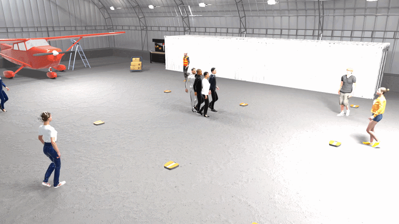

# [Diffusion for Long-Horizon Multi-Robot Path Planning in Human-Shared Environments](https://vaibhavsanjay.github.io/MRRD-Website/)

<table style="border: none;">
<tr>
<td style="vertical-align: middle; border: none;">
  <a href="https://arxiv.org/abs/2607.09911">
    
  </a>
</td>
<td style="vertical-align: middle; border: none;">
  <i>Sanjay, V., Shaoul, Y., Li, J., 2026. <strong>Diffusion for Long-Horizon Multi-Robot Path Planning in Human-Shared Environments</strong>. arXiv preprint arXiv:2607.09911.</i>
</td>
</tr>
</table>




---
## Installation
We have tested our code on Ubuntu 20.04 with CUDA version 12.2. This installation process is very similar to that of [MMD](https://github.com/yoraish/mmd).

### Requirements
- [miniconda](https://docs.conda.io/projects/miniconda/en/latest/index.html)

### Installation Steps
1. Clone this repository and change directory into it:
    ```bash
    git clone https://github.com/vaibhavsanjay/mrrd.git
    cd mrrd
    ```
2. Create a conda environment and activate it:
    ```bash
    conda env create -f environment.yml
    conda activate mrrd
    ```
3. Install PyTorch. This may be different depending on your system. We used the following command:
    ```bash
   conda install pytorch torchvision torchaudio pytorch-cuda=12.1 -c pytorch -c nvidia
    ```
4. Install the local packages. Those are mostly the work of [An Thai Le](https://github.com/anindex) and [João Carvalho](https://github.com/jacarvalho). Thank you for sharing your code!
    ```bash
   cd deps/torch_robotics
   pip install -e .
   cd ../experiment_launcher
   pip install -e .
   cd ../motion_planning_baselines
   pip install -e .
   cd ../..
   ```
5. Install the `mrrd` package:
    ```bash
    pip install -e .
    ```

---
## Usage
Here we explain how to run MRRD.

### Obtaining Sample Datasets and Models
Before you can run inference, you need to download the required model and datasets. Download the folders from [Google Drive](https://drive.google.com/drive/folders/19E2Iil8YFKwU39kHtE_zF6847EMwROei?usp=sharing) into the mrrd folder.

The expected file structure is
```
mrrd/
├── data_human_trajectories/
│   └── ucy_scenarios2.pt
├── data_trained_models/
│   └── HumanDiffusion/
└── data_trajectories/
    └── human_trajectories_rotated_1000_long/
```

### Running MRRD
We can use the inference script to run a simple example.

```bash
conda activate mrrd
cd scripts/inference
python3 inference_multi_agent.py
```

You can change the `env_id` variable in this script to change which map is used. The results will be saved under the `mrrd/scripts/inference/results/` directory.

## Training a New Diffusion Model
Before training, make sure you have downloaded the training data from Google Drive. Once training data is downloaded, run the following script.
```bash
cd scripts/train_diffusion
python3 launch_train_01.py
```

---
## Citation

If you use our work or code in your research, please cite our paper:
```latex
@article{sanjay2026mrrd,
  title={Diffusion for Long-Horizon Multi-Robot Path Planning in Human-Shared Environments},
  author={Sanjay, Vaibhav and Shaoul, Yorai and Li, Jiaoyang},
  booktitle = {IEEE/RSJ International Conference on Intelligent Robots and Systems (IROS)},
  year={2026}
}
```

---
## Credits
This work is largely inspired by the following works:
- [Multi-Robot Motion Planning with Diffusion Models](https://github.com/yoraish/mmd): MRRD was built off of the codebase of MMD.
- [Diffusion-Based Conditional Robot Planning in Dynamic Environments Using Control Barrier and Lyapunov Functions](https://github.com/m-kazuki/cobl_diffusion): MRRD utilizes a similar setup for training the single-robot diffusion models from human path data.


